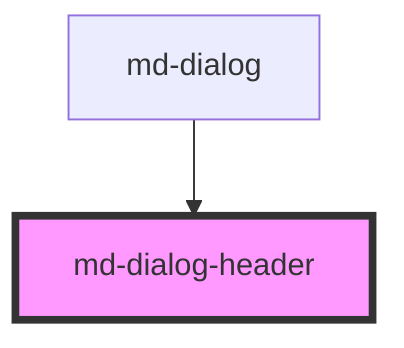

# md-dialog-header

<!-- Auto Generated Below -->

## Properties

| Property | Attribute | Description | Type     | Default    |
| -------- | --------- | ----------- | -------- | ---------- |
| `title`  | `title`   |             | `string` | `'Dialog'` |

## Dependencies

### Used by

 - [md-dialog]()

### Graph

----------------------------------------------

*Built with [StencilJS](https://stenciljs.com/)*
